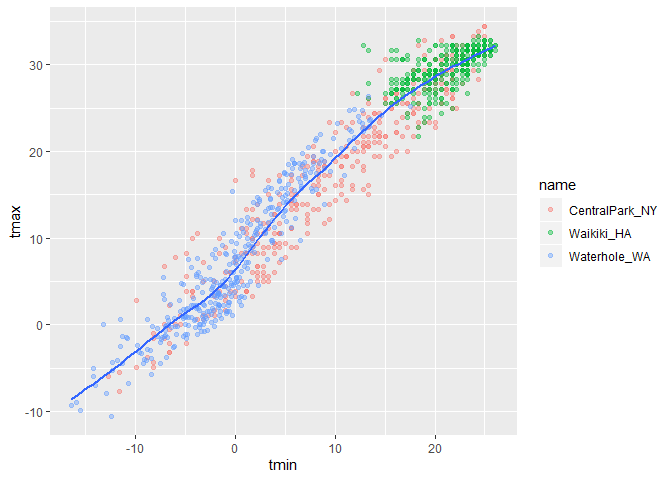
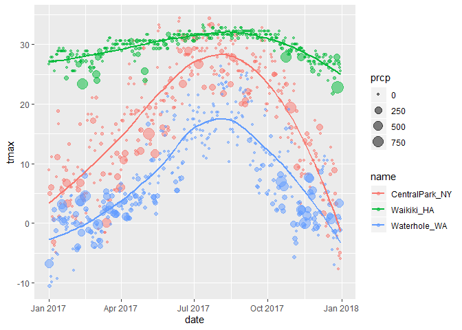
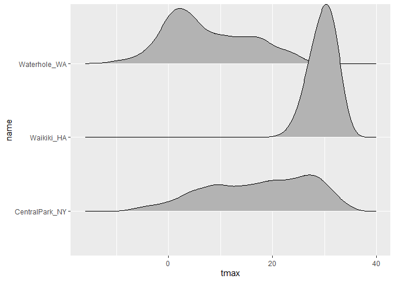
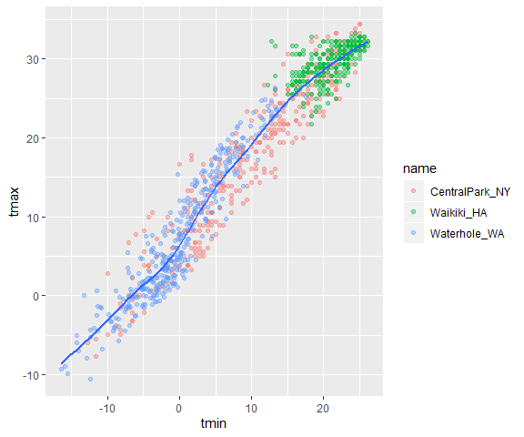
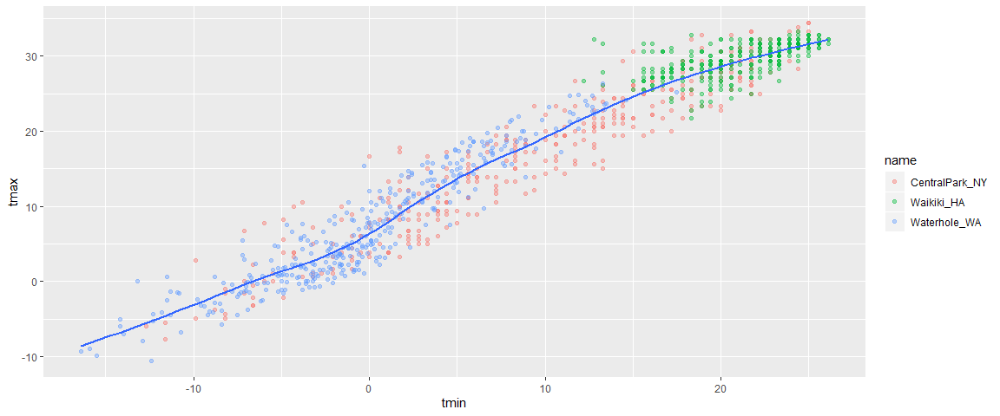

ggplot 1
================
Julia Thompson
9/26/2019

## Create the weather data

``` r
weather_df = 
  rnoaa::meteo_pull_monitors(c("USW00094728", "USC00519397", "USS0023B17S"),
                      var = c("PRCP", "TMIN", "TMAX"), 
                      date_min = "2017-01-01",
                      date_max = "2017-12-31") %>%
  mutate(
    name = dplyr::recode(id, USW00094728 = "CentralPark_NY", 
                      USC00519397 = "Waikiki_HA",
                      USS0023B17S = "Waterhole_WA"),
    tmin = tmin / 10,
    tmax = tmax / 10) %>%
  select(name, id, everything())
```

    ## Registered S3 method overwritten by 'crul':
    ##   method                 from
    ##   as.character.form_file httr

    ## Registered S3 method overwritten by 'hoardr':
    ##   method           from
    ##   print.cache_info httr

    ## file path:          C:\Users\jbenn\AppData\Local\rnoaa\rnoaa\Cache/ghcnd/USW00094728.dly

    ## file last updated:  2019-09-26 10:36:48

    ## file min/max dates: 1869-01-01 / 2019-09-30

    ## file path:          C:\Users\jbenn\AppData\Local\rnoaa\rnoaa\Cache/ghcnd/USC00519397.dly

    ## file last updated:  2019-09-26 10:37:08

    ## file min/max dates: 1965-01-01 / 2019-09-30

    ## file path:          C:\Users\jbenn\AppData\Local\rnoaa\rnoaa\Cache/ghcnd/USS0023B17S.dly

    ## file last updated:  2019-09-26 10:37:15

    ## file min/max dates: 1999-09-01 / 2019-09-30

``` r
ggplot(weather_df, aes(x=tmin, y=tmax)) + 
  geom_point()
```

    ## Warning: Removed 15 rows containing missing values (geom_point).

<!-- -->

Alternate way of making the same plot

``` r
weather_df %>%
  ggplot(aes(x = tmin, y = tmax)) + 
  geom_point()
```

    ## Warning: Removed 15 rows containing missing values (geom_point).

<!-- -->

Saving initial plots

``` r
scatterplot = 
  weather_df %>%
  ggplot(aes(x = tmin, y = tmax)) + 
  geom_point()

scatterplot
```

    ## Warning: Removed 15 rows containing missing values (geom_point).

<!-- -->

Adding color

``` r
weather_df %>%
  ggplot(aes(x = tmin, y = tmax)) + 
  geom_point(aes(color = name), alpha = .4) + 
  geom_smooth(se = FALSE)
```

    ## `geom_smooth()` using method = 'gam' and formula 'y ~ s(x, bs = "cs")'

    ## Warning: Removed 15 rows containing non-finite values (stat_smooth).

    ## Warning: Removed 15 rows containing missing values (geom_point).

<!-- -->

``` r
weather_df %>%
  ggplot(aes(x = tmin, y = tmax, color = name)) + 
  geom_point(aes(color = name), alpha = .4) + 
  geom_smooth(se = FALSE) + 
  facet_grid(~name)
```

    ## `geom_smooth()` using method = 'loess' and formula 'y ~ x'

    ## Warning: Removed 15 rows containing non-finite values (stat_smooth).

    ## Warning: Removed 15 rows containing missing values (geom_point).

<!-- -->

New plot

``` r
weather_df %>%
  ggplot(aes(x = date, y = tmax, color = name)) + 
  geom_point(aes(size = prcp), alpha = .5) + 
  geom_smooth(se = FALSE)
```

    ## `geom_smooth()` using method = 'loess' and formula 'y ~ x'

    ## Warning: Removed 3 rows containing non-finite values (stat_smooth).

    ## Warning: Removed 3 rows containing missing values (geom_point).

<!-- -->

Learning assessment

``` r
weather_df %>% 
  filter(name == "CentralPark_NY") %>% 
  mutate(tmax_fahr = tmax * (9 / 5) + 32,
         tmin_fahr = tmin * (9 / 5) + 32) %>% 
  ggplot(aes(x = tmin_fahr, y = tmax_fahr)) +
  geom_point(alpha = .5) + 
  geom_smooth(method = "lm", se = FALSE)
```

<!-- -->

2D density

``` r
weather_df %>%
  ggplot(aes(x = tmin, y = tmax)) + 
  geom_bin2d() #instal hexbin to use geom_hex()
```

    ## Warning: Removed 15 rows containing non-finite values (stat_bin2d).

<!-- -->

## Even more plots

Univariate plots – understanding one variable\!

``` r
weather_df %>%
  ggplot(aes(x = tmax, fill = name)) + 
  geom_histogram(position = "dodge")
```

    ## `stat_bin()` using `bins = 30`. Pick better value with `binwidth`.

    ## Warning: Removed 3 rows containing non-finite values (stat_bin).

<!-- -->

``` r
weather_df %>%
  ggplot(aes(x = tmax, fill = name)) + 
  geom_histogram() + 
  facet_grid(~name)
```

    ## `stat_bin()` using `bins = 30`. Pick better value with `binwidth`.

    ## Warning: Removed 3 rows containing non-finite values (stat_bin).

<!-- -->

Density plot

``` r
weather_df %>%
  ggplot(aes(x = tmax, fill = name)) + 
  geom_density(alpha = .3) 
```

    ## Warning: Removed 3 rows containing non-finite values (stat_density).

<!-- -->

``` r
weather_df %>%
  ggplot(aes(x = name, y = tmax)) +
  geom_boxplot()
```

    ## Warning: Removed 3 rows containing non-finite values (stat_boxplot).

<!-- -->

Violin plots. These could be useful when you have a lot of groups and
you want to check for bimodality etc. but otherwise not that great.

``` r
weather_df %>%
  ggplot(aes(x = name, y = tmax)) +
  geom_violin()
```

    ## Warning: Removed 3 rows containing non-finite values (stat_ydensity).

<!-- -->

Ridge plots - useful when you have lots of groups

``` r
weather_df %>%
  ggplot(aes(x = tmax, y = name)) +
  geom_density_ridges()
```

    ## Picking joint bandwidth of 1.84

    ## Warning: Removed 3 rows containing non-finite values (stat_density_ridges).

<!-- -->

## Saving a plot

Note: you can save by clicking export on the right plot panel, but this
is not reproducable so don’t do it. Write it in your code\!

``` r
ggp_ridge_temp = 
  weather_df %>%
  ggplot(aes(x = tmax, y = name)) +
  geom_density_ridges()

ggsave("ggplot_temp_ridge.pdf", ggp_ridge_temp)
```

    ## Saving 7 x 5 in image

    ## Picking joint bandwidth of 1.84

    ## Warning: Removed 3 rows containing non-finite values (stat_density_ridges).

``` r
weather_df %>%
  ggplot(aes(x = tmin, y = tmax)) + 
  geom_point(aes(color = name), alpha = .4) + 
  geom_smooth(se = FALSE)
```

    ## `geom_smooth()` using method = 'gam' and formula 'y ~ s(x, bs = "cs")'

    ## Warning: Removed 15 rows containing non-finite values (stat_smooth).

    ## Warning: Removed 15 rows containing missing values (geom_point).

<!-- -->

``` r
weather_df %>%
  ggplot(aes(x = tmin, y = tmax)) + 
  geom_point(aes(color = name), alpha = .4) + 
  geom_smooth(se = FALSE)
```

    ## `geom_smooth()` using method = 'gam' and formula 'y ~ s(x, bs = "cs")'

    ## Warning: Removed 15 rows containing non-finite values (stat_smooth).

    ## Warning: Removed 15 rows containing missing values (geom_point).

<!-- -->
