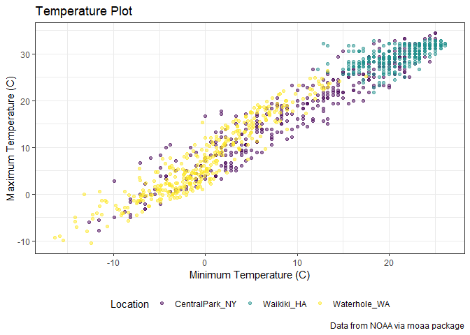

ggplot 2
================
Julia Thompson
10/1/2019

## Create the weather data

``` r
weather_df = 
  rnoaa::meteo_pull_monitors(c("USW00094728", "USC00519397", "USS0023B17S"),
                      var = c("PRCP", "TMIN", "TMAX"), 
                      date_min = "2017-01-01",
                      date_max = "2017-12-31") %>%
  mutate(
    name = dplyr::recode(id, USW00094728 = "CentralPark_NY", 
                      USC00519397 = "Waikiki_HA",
                      USS0023B17S = "Waterhole_WA"),
    tmin = tmin / 10,
    tmax = tmax / 10) %>%
  select(name, id, everything())
```

    ## Registered S3 method overwritten by 'crul':
    ##   method                 from
    ##   as.character.form_file httr

    ## Registered S3 method overwritten by 'hoardr':
    ##   method           from
    ##   print.cache_info httr

    ## file path:          C:\Users\jbenn\AppData\Local\rnoaa\rnoaa\Cache/ghcnd/USW00094728.dly

    ## file last updated:  2019-09-26 10:36:48

    ## file min/max dates: 1869-01-01 / 2019-09-30

    ## file path:          C:\Users\jbenn\AppData\Local\rnoaa\rnoaa\Cache/ghcnd/USC00519397.dly

    ## file last updated:  2019-09-26 10:37:08

    ## file min/max dates: 1965-01-01 / 2019-09-30

    ## file path:          C:\Users\jbenn\AppData\Local\rnoaa\rnoaa\Cache/ghcnd/USS0023B17S.dly

    ## file last updated:  2019-09-26 10:37:15

    ## file min/max dates: 1999-09-01 / 2019-09-30

## Making new plots\!

Start with an old plot:

``` r
weather_df %>%
  ggplot(aes(x = tmin, y = tmax, color = name)) + 
  geom_point(alpha = .5)
```

    ## Warning: Removed 15 rows containing missing values (geom_point).

<!-- -->

Add labels:

``` r
weather_df %>%
  ggplot(aes(x = tmin, y = tmax, color = name)) + 
  geom_point(alpha = .5) + 
  labs(
    title = "Temperature Plot",
    x = "Minimum Temperature (C)",
    y = "Maximum Temperature (C)",
    caption = "Data from NOAA via rnoaa package"
  )
```

    ## Warning: Removed 15 rows containing missing values (geom_point).

<!-- -->

x axis tick marks etc

``` r
weather_df %>%
  ggplot(aes(x = tmin, y = tmax, color = name)) + 
  geom_point(alpha = .5) + 
  labs(
    title = "Temperature Plot",
    x = "Minimum Temperature (C)",
    y = "Maximum Temperature (C)",
    caption = "Data from NOAA via rnoaa package"
  ) +
  scale_x_continuous(
    breaks = c(-15, -5, 20),
    labels = c("-15C", "-5 (brr)", "20")
  ) +
  scale_y_continuous(
    trans = "sqrt"
  )
```

    ## Warning in self$trans$transform(x): NaNs produced

    ## Warning: Transformation introduced infinite values in continuous y-axis

    ## Warning: Removed 90 rows containing missing values (geom_point).

<!-- -->

## Colors\!

``` r
weather_df %>%
  ggplot(aes(x = tmin, y = tmax, color = name)) + 
  geom_point(alpha = .5) + 
  labs(
    title = "Temperature Plot",
    x = "Minimum Temperature (C)",
    y = "Maximum Temperature (C)",
    caption = "Data from NOAA via rnoaa package"
  ) +
  scale_color_hue(
    name = "Weather Station",
    h = c(50, 250)
  ) 
```

    ## Warning: Removed 15 rows containing missing values (geom_point).

<!-- -->

A better way to do this:

``` r
ggp_base = 
  weather_df %>%
  ggplot(aes(x = tmin, y = tmax, color = name)) + 
  geom_point(alpha = .5) + 
  labs(
    title = "Temperature Plot",
    x = "Minimum Temperature (C)",
    y = "Maximum Temperature (C)",
    caption = "Data from NOAA via rnoaa package"
  ) +
  viridis::scale_color_viridis(
    name = "Location", 
    discrete = TRUE
  )
```

## Themes

``` r
ggp_base +
  theme(legend.position = "bottom")
```

    ## Warning: Removed 15 rows containing missing values (geom_point).

<!-- -->

There are TONS of themes…

``` r
ggp_base +
  theme_bw() + #order matters- overarching things go first, tweaks go second
  theme(legend.position = "bottom") #change to "none" if you don't want a legend
```

    ## Warning: Removed 15 rows containing missing values (geom_point).

<!-- -->

## More than one dataset

``` r
central_park = 
  weather_df %>% 
  filter(name == "CentralPark_NY")

waikiki = 
  weather_df %>% 
  filter(name == "Waikiki_HA")

ggplot(data = waikiki, aes(x = date, y = tmax, color = name)) + 
  geom_point() + 
  geom_line(data = central_park)
```

    ## Warning: Removed 3 rows containing missing values (geom_point).

<!-- -->

Brief aside about colors:

``` r
waikiki %>%
  ggplot(aes(x = date, y = tmax)) + 
  geom_point(color = "blue")
```

    ## Warning: Removed 3 rows containing missing values (geom_point).

<!-- -->

## Multi-panel plots

``` r
ggp_scatter =
  weather_df %>%
  ggplot(aes(x = tmin, y = tmax)) +
  geom_point()

ggp_density = 
  weather_df %>%
  ggplot(aes(x = tmin)) +
  geom_density()

ggp_box = 
  weather_df %>%
  ggplot(aes(x = name, y = tmax)) +
  geom_boxplot()

# (ggp_scatter + ggp_density) / ggp_box
# Install package
```

## Data Manipulation

Change the order of the plots:

``` r
weather_df %>%
  mutate(
    name = factor(name),
    name = fct_relevel(name, "Waikiki_HA", "CentralPark_NY")
  ) %>%
  ggplot(aes(x = name, y = tmax, color = name)) +
  geom_boxplot()
```

    ## Warning: Removed 3 rows containing non-finite values (stat_boxplot).

<!-- -->

Or you can use fct\_reorder to order by temperature:

``` r
weather_df %>%
  mutate(
    name = factor(name),
    name = fct_reorder(name, tmax)
  ) %>%
  ggplot(aes(x = name, y = tmax, color = name)) +
  geom_boxplot()
```

    ## Warning: Removed 3 rows containing non-finite values (stat_boxplot).

<!-- -->

## Restructure then plot

``` r
weather_df %>%
  pivot_longer(
    tmax:tmin,
    names_to = "observation", 
    values_to = "temperature") %>% 
  ggplot(aes(x = temperature, fill = observation)) +
  geom_density(alpha = .5) + 
  facet_grid(~name)
```

    ## Warning: Removed 18 rows containing non-finite values (stat_density).

<!-- -->

FAS data

``` r
pup_data = 
  read_csv("./data/FAS_pups.csv", col_types = "ciiiii") %>%
  janitor::clean_names() %>%
  mutate(sex = recode(sex, `1` = "male", `2` = "female")) 

litter_data = 
  read_csv("./data/FAS_litters.csv", col_types = "ccddiiii") %>%
  janitor::clean_names() %>%
  select(-pups_survive) %>%
  separate(group, into = c("dose", "day_of_tx"), sep = 3) %>%
  mutate(wt_gain = gd18_weight - gd0_weight,
         day_of_tx = as.numeric(day_of_tx))

fas_data = left_join(pup_data, litter_data, by = "litter_number") 
```

``` r
fas_data %>%
  pivot_longer(
    pd_ears:pd_walk,
    names_to = "outcome",
    values_to = "pn_day"
  ) %>%
  drop_na() %>%
  mutate(
    outcome = factor(outcome),
    outcome = fct_reorder(outcome, pn_day)
  ) %>%
  ggplot(aes(x = dose, y = pn_day)) +
  geom_violin() +
  facet_grid(day_of_tx ~ outcome)
```

<!-- -->
