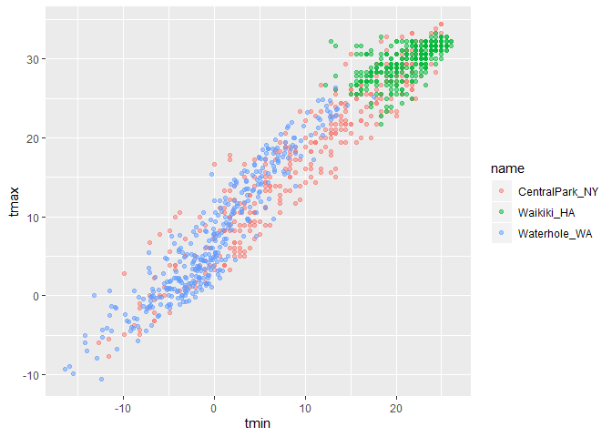

ggplot 2
================
Julia Thompson
10/1/2019

## Create the weather data

``` r
weather_df = 
  rnoaa::meteo_pull_monitors(c("USW00094728", "USC00519397", "USS0023B17S"),
                      var = c("PRCP", "TMIN", "TMAX"), 
                      date_min = "2017-01-01",
                      date_max = "2017-12-31") %>%
  mutate(
    name = dplyr::recode(id, USW00094728 = "CentralPark_NY", 
                      USC00519397 = "Waikiki_HA",
                      USS0023B17S = "Waterhole_WA"),
    tmin = tmin / 10,
    tmax = tmax / 10) %>%
  select(name, id, everything())
```

    ## Registered S3 method overwritten by 'crul':
    ##   method                 from
    ##   as.character.form_file httr

    ## Registered S3 method overwritten by 'hoardr':
    ##   method           from
    ##   print.cache_info httr

    ## file path:          C:\Users\jbenn\AppData\Local\rnoaa\rnoaa\Cache/ghcnd/USW00094728.dly

    ## file last updated:  2019-09-26 10:36:48

    ## file min/max dates: 1869-01-01 / 2019-09-30

    ## file path:          C:\Users\jbenn\AppData\Local\rnoaa\rnoaa\Cache/ghcnd/USC00519397.dly

    ## file last updated:  2019-09-26 10:37:08

    ## file min/max dates: 1965-01-01 / 2019-09-30

    ## file path:          C:\Users\jbenn\AppData\Local\rnoaa\rnoaa\Cache/ghcnd/USS0023B17S.dly

    ## file last updated:  2019-09-26 10:37:15

    ## file min/max dates: 1999-09-01 / 2019-09-30

## Making new plots\!

Start with an old plot:

``` r
weather_df %>%
  ggplot(aes(x = tmin, y = tmax, color = name)) + 
  geom_point(alpha = .5)
```

    ## Warning: Removed 15 rows containing missing values (geom_point).

<!-- -->

Add labels:

``` r
weather_df %>%
  ggplot(aes(x = tmin, y = tmax, color = name)) + 
  geom_point(alpha = .5) + 
  labs(
    title = "Temperature Plot",
    x = "Minimum Temperature (C)",
    y = "Maximum Temperature (C)",
    caption = "Data from NOAA via rnoaa package"
  )
```

    ## Warning: Removed 15 rows containing missing values (geom_point).

<!-- -->

x axis tick marks etc

``` r
weather_df %>%
  ggplot(aes(x = tmin, y = tmax, color = name)) + 
  geom_point(alpha = .5) + 
  labs(
    title = "Temperature Plot",
    x = "Minimum Temperature (C)",
    y = "Maximum Temperature (C)",
    caption = "Data from NOAA via rnoaa package"
  ) +
  scale_x_continuous(
    breaks = c(-15, -5, 20),
    labels = c("-15C", "-5 (brr)", "20")
  ) +
  scale_y_continuous(
    trans = "sqrt"
  )
```

    ## Warning in self$trans$transform(x): NaNs produced

    ## Warning: Transformation introduced infinite values in continuous y-axis

    ## Warning: Removed 90 rows containing missing values (geom_point).

<!-- -->

## Colors\!

``` r
weather_df %>%
  ggplot(aes(x = tmin, y = tmax, color = name)) + 
  geom_point(alpha = .5) + 
  labs(
    title = "Temperature Plot",
    x = "Minimum Temperature (C)",
    y = "Maximum Temperature (C)",
    caption = "Data from NOAA via rnoaa package"
  ) +
  scale_color_hue(
    name = "Weather Station",
    h = c(50, 250)
  ) 
```

    ## Warning: Removed 15 rows containing missing values (geom_point).

<!-- -->

A better way to do this:

``` r
ggp_base = 
  weather_df %>%
  ggplot(aes(x = tmin, y = tmax, color = name)) + 
  geom_point(alpha = .5) + 
  labs(
    title = "Temperature Plot",
    x = "Minimum Temperature (C)",
    y = "Maximum Temperature (C)",
    caption = "Data from NOAA via rnoaa package"
  ) +
  viridis::scale_color_viridis(
    name = "Location", 
    discrete = TRUE
  )
```

## Themes

``` r
ggp_base +
  theme(legend.position = "bottom")
```

    ## Warning: Removed 15 rows containing missing values (geom_point).

<!-- -->

There are TONS of themes…

``` r
ggp_base +
  theme_bw() + #order matters- overarching things go first, tweaks go second
  theme(legend.position = "bottom") #change to "none" if you don't want a legend
```

    ## Warning: Removed 15 rows containing missing values (geom_point).

<!-- -->
